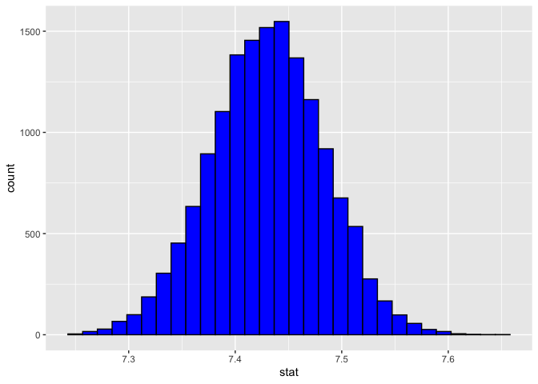
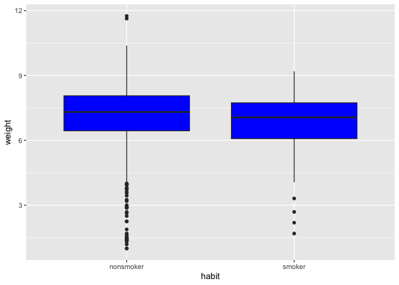

Lab 11 - Smoking during pregnancy
================
Lindsey Wilson
5/3/23

### Load packages and data

``` r
library(tidyverse) 
library(tidymodels)
library(openintro)
```

``` r
nc <- ncbirths
set.seed(85920305)
```

## Part 1

### Exercise 1

There are 1000 cases in the dataset, where each case represents one baby
born in North Carolina in 2004

### Exercise 2

Let’s filter our dataset to only include babies born to White mothers
and calculate their average birth weight:

``` r
ncbirths_white <- nc %>%
  filter(whitemom == "white")

mean(ncbirths_white$weight)
```

    ## [1] 7.250462

Looks like the average White baby (or at least, the average baby born to
a White mother) weighed 7.25. pounds at birth in 2004

### Exercise 3

I think so. I’m not totally sure what this is asking, but as far as I
can tell the observations are independent (for example, nothing would
allow us to tell whether individuals in the dataset are related in any
way)

### Exercise 4

Let’s actually run our test using bootstrapping:

``` r
df_boot_weight <- ncbirths_white %>%
  specify(response = weight) %>%
  generate(reps = 15000, type = "bootstrap") %>%
  calculate(stat = "mean")

df_boot_weight <- df_boot_weight %>%
  mutate(stat = stat + (7.43 - mean(ncbirths_white$weight)))

df_boot_weight %>%
  ggplot(aes(x = stat)) + 
  geom_histogram(color = "black", fill = "blue")
```

    ## `stat_bin()` using `bins = 30`. Pick better value with `binwidth`.

<!-- -->

``` r
upper_tail <- sum(df_boot_weight$stat >= 7.61)/length(df_boot_weight$stat)
lower_tail <- sum(df_boot_weight$stat <= 7.25)/length(df_boot_weight$stat)
p_val <- upper_tail + lower_tail
```

Based on this calculation, it looks like the 2-tailed p-value for our
observed sample mean of 7.25 is .00053, which is much less than .05.
Therefore, it looks like our observed sample of White babies in 2004
weighed significantly less than White babies in 1995.

## Part 2

### Exercise 5

Let’s visualize weight for smokers vs. nonsmokers:

``` r
nc %>%
  drop_na(habit) %>%
  ggplot(aes(x= habit, y = weight)) +
  geom_boxplot(fill = "blue")
```

<!-- -->

What we can see from these plots is that: 1.) The mean birth weight of
babies born to smokers and nonsmokers isn’t very different, and 2.)
There is a ton of variability in both groups

### Exercise 6

Before moving on, let’s clean the dataset more permanently by creating a
new dataframe where values of “NA” for `habit` and `weight` are filtered
out:

``` r
ncbirths_clean <- nc %>%
  drop_na(habit) %>%
  drop_na(weight)
```

### Exercise 7

Now let’s calculate the difference in weight between smokers and
nonsmokers

``` r
ncbirths_clean %>%
  group_by(habit) %>%
  summarise(mean_weight = mean(weight))
```

    ## # A tibble: 2 × 2
    ##   habit     mean_weight
    ##   <fct>           <dbl>
    ## 1 nonsmoker        7.14
    ## 2 smoker           6.83

This makes the difference in mean weight between the groups 0.316
pounds, where babies of nonsmokers weigh slightly more.

### Exercise 8

H0: Babies born to smokers do not differ in weight from babies born to
nonsmokers

H1: Babies born to smokers differ in weight from babies born to
nonsmokers

### Exercise 9

Now let’s actually run the hypothesis test:

``` r
#Smokers
df_boot_smoker <- ncbirths_clean %>%
  filter(habit == "smoker") %>%
  specify(response = weight) %>%
  generate(reps = 15000, type = "bootstrap") %>%
  calculate(stat = "mean")
  
#Nonsmokers
df_boot_nonsmoker <- ncbirths_clean %>%
  filter(habit == "nonsmoker") %>%
  specify(response = weight) %>%
  generate(reps = 15000, type = "bootstrap") %>%
  calculate(stat = "mean")
  
#Take the difference between groups
df_boot_diff <- (df_boot_nonsmoker$stat - df_boot_smoker$stat) %>%
  as.data.frame() %>%
  setNames("MeanDiff")

#Calculate deviations
df_boot_diff_devs <- (df_boot_diff$MeanDiff - mean(df_boot_diff$MeanDiff)) %>%
  as.data.frame() %>%
  setNames("MeanDev")

#Calculate p value
upper_tail_2 <- (sum(df_boot_diff_devs$MeanDev >= mean(df_boot_diff$MeanDiff))/length(df_boot_diff$MeanDiff))

lower_tail_2 <- (sum(df_boot_diff_devs$MeanDev <= mean(df_boot_diff$MeanDiff)*-1)/length(df_boot_diff$MeanDiff))

p_val_2 <- upper_tail_2 + lower_tail_2
p_val_2
```

    ## [1] 0.01953333

And the p-value I got here was .0157. Therefore, it does look like
there’s a significant difference in weight between babies born to moms
who smoke versus those who don’t.

### Exercise 10

And let’s add a 95% confidence interval for the mean difference in birth
weight between babies born to smokers vs. nonsmokers:

``` r
df_boot_diff %>%
  summarise(lower = quantile(MeanDiff, 0.025),
            upper = quantile(MeanDiff, 0.975))
```

    ##        lower     upper
    ## 1 0.05844224 0.5802881

It looks like zero does not fall within the interval. This again
suggests that there’s a real difference in birth weight between babies
of smokers vs. nonsmokers.

## Part 3

### Exercise 11

Let’s see what the age cutoffs are for the categories in the `mature`
variable

``` r
nc %>%
  group_by(mature) %>%
  summarise(min(mage), max(mage))
```

    ## # A tibble: 2 × 3
    ##   mature      `min(mage)` `max(mage)`
    ##   <fct>             <int>       <int>
    ## 1 mature mom           35          50
    ## 2 younger mom          13          34

So it. looks like “younger mom” category ranges from age 13 to 34, and
“older mom” covers any mother 35 and over.

### Exercise 12

Now let’s run a hypothesis test comparing the proportion of low
birthweight mothers between younger and mature moms (I’d like to give
Conor credit for helping me out on this; I used his code as a template
after I got stuck on this)

Hypotheses:

- H0: the proportion of low birthweight mothers does not differ between
  younger and mature moms.

- H1: the proportion of low birthweight mothers does differ between
  younger and mature moms.

``` r
#Generate data sets
df_lo_mature <- ncbirths %>%
  filter(mature == "mature mom")

df_lo_young <- ncbirths %>%
  filter(mature == "younger mom") 

#Observed values
lo_mature <- sum((df_lo_mature$lowbirthweight == "low")/(nrow(df_lo_mature)))
lo_young <- sum((df_lo_young$lowbirthweight == "low")/(nrow(df_lo_young)))
obs <- lo_mature - lo_young

#Bootstrap 
boot_mature <- df_lo_mature %>% 
  specify(response = lowbirthweight, success = "low") %>% 
  generate(reps = 15000, type = "bootstrap") %>% 
  calculate(stat = "prop")

boot_young <- df_lo_young %>% 
  specify(response = lowbirthweight, success = "low") %>% 
  generate(reps = 15000, type = "bootstrap") %>%
  calculate(stat = "prop")

prop_diff <- (boot_mature$stat - boot_young$stat) %>% 
  as.data.frame() %>% 
  setNames("stat")

#Run Test 
prop_diff_c <- (prop_diff$stat - mean(prop_diff$stat)) %>% 
  as.data.frame() %>%
  #re-center at null
  setNames("stat")
sum((prop_diff_c$stat >= obs)/(nrow(prop_diff_c)))
```

    ## [1] 0.1834

Therefore, it looks like we don’t have evidence of difference in the
proportion of low birthweight babies between young and mature moms.

### Exercise 13

The 95% confidence interval for the difference in the proportion of low
birthweight babies born to young vs. mature moms is calculated below:

``` r
prop_diff %>%
  summarise(lower = quantile(stat, 0.025),
            upper = quantile(stat, 0.975))
```

    ##         lower      upper
    ## 1 -0.03148008 0.09223751

We can be 95% confident that the true difference in low birthweight
proportion between young and mature moms falls between -0.031 and 0.091.
Since zero falls within this range, we don’t have evidence to suggest
there’s a difference between the two groups.
